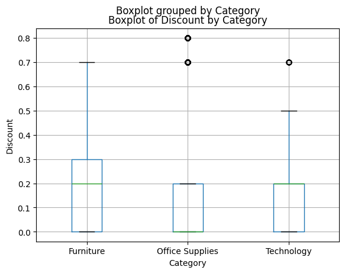

# Regional Performance Anomaly Detection

A Python pipeline that applies statistical outlier detection (IQR) to retail order
data, identifying pricing and discounting anomalies at both an aggregate and an
individual-order level, with automated reporting via PowerPoint.

## Problem

Manual variance analysis across regions and categories is slow and inconsistent.
This project explores whether a simple, well-understood statistical method — the
interquartile range (IQR) — can systematically flag anomalies worth a human's
attention, without relying on manual thresholds or spreadsheet review.

## Dataset

Superstore sales dataset (~10,000 orders): Region, Category, Sub-Category, Sales,
Discount, Profit.

## Method

Outlier detection via IQR (`Q1 - 1.5×IQR` to `Q3 + 1.5×IQR`), the same logic
behind a boxplot's whiskers. Applied at two levels:

1. **Aggregated** — profit margin by Region × Sub-Category (68 combinations)
2. **Order-level** — discount rate per order, benchmarked against each
   Category's own distribution (`groupby().transform()`)

## Key findings

- **Aggregated level:** no statistical outliers detected. This is an expected
  result, not a null finding — aggregating individual orders into 68 combinations
  smooths out extremes that IQR is designed to catch. Demonstrates the method
  was applied correctly rather than tuned to force a result.
- **Order level:** ~7% of orders (703 of 9,994) flagged as unusually high
  discount relative to their Category's norm, concentrated in Office Supplies
  orders discounted 70–80%. A concrete, actionable finding.



## Automation

The pipeline runs end to end: data load → outlier detection → chart generation
→ auto-populated PowerPoint summary slide (via `python-pptx`). Not a one-off
script — rerunnable against updated data.

## Tech stack

Python, pandas, matplotlib, python-pptx

## How to run

```bash
pip install pandas matplotlib python-pptx
python scripts/region_anomaly_detection.py
```

## Repo structure

```
├── scripts/
│   └── regional_performance_anomaly_detection.py
├── data/
│   ├── superstore.csv
│   ├── template.pptx
│   └── discount_boxplot.png
└── README.md
```