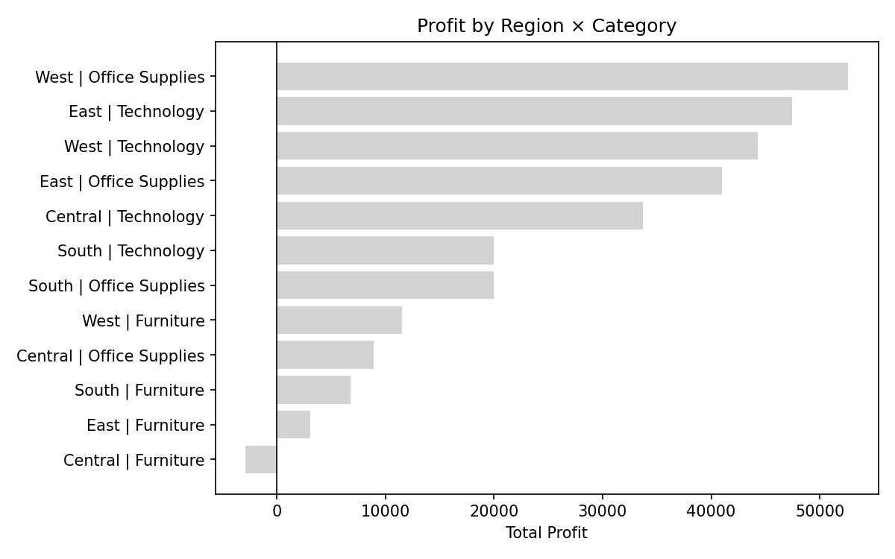
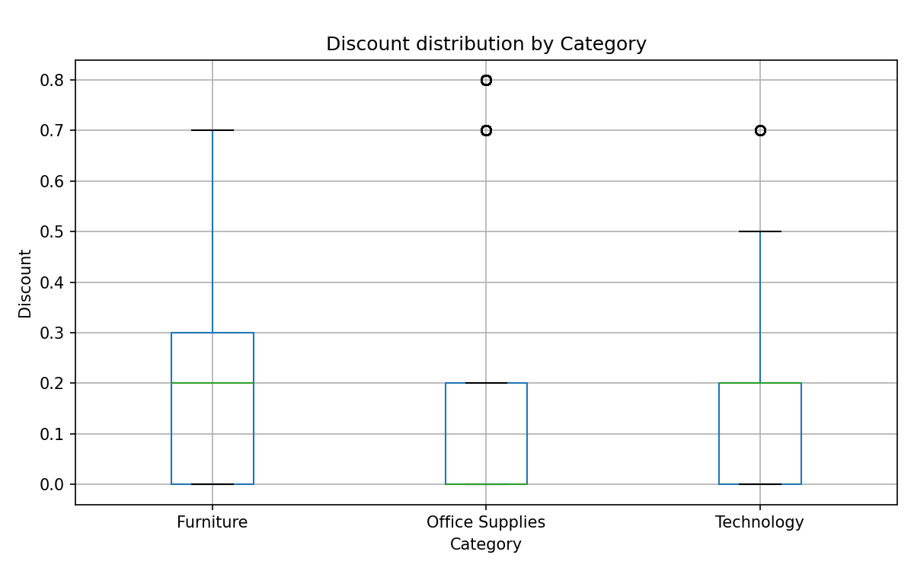
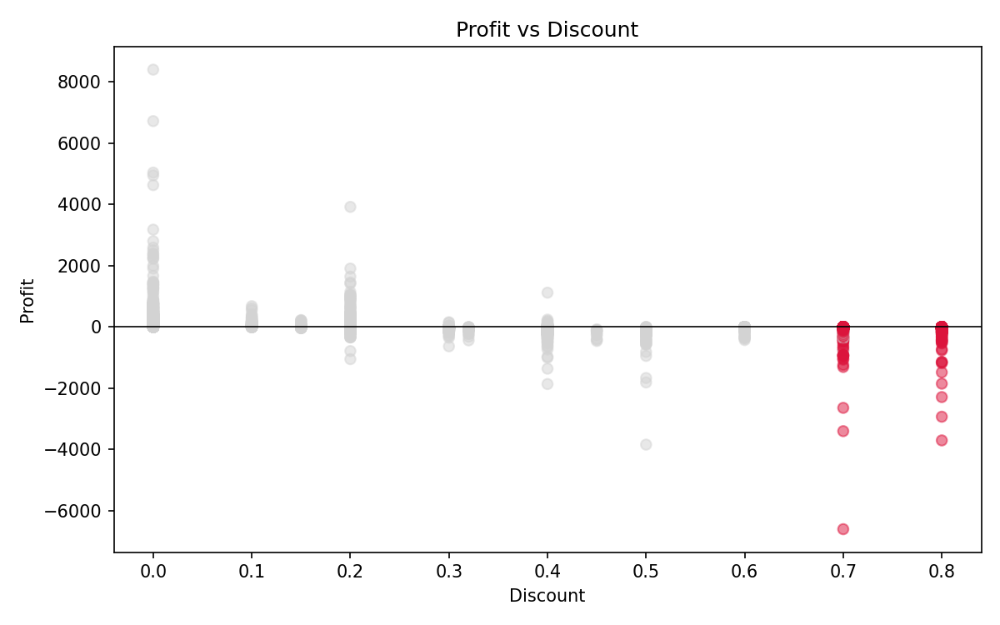

# Regional Performance Anomaly Detection

A Python pipeline that applies statistical outlier detection (IQR) to retail order
data, identifying pricing and discounting anomalies at both an aggregate and an
individual-order level, quantifying their profit impact, with automated reporting via PowerPoint.

## Problem

Manual variance analysis across regions and categories is slow and inconsistent.
This project explores whether a simple, well-understood statistical method — the
interquartile range (IQR) — can systematically flag anomalies worth a human's
attention, without relying on manual thresholds or spreadsheet review.

## Dataset

Superstore sales dataset (~10,000 orders): Region, Category, Sub-Category, Sales,
Discount, Profit.

## Method

Outlier detection via IQR (`Q1 - 1.5×IQR` to `Q3 + 1.5×IQR`), the same logic
behind a boxplot's whiskers. Applied at two levels:

1. **Aggregated** — profit margin by Region × Sub-Category (68 combinations),
   and total profit by Region × Category (12 combinations)
2. **Order-level** — discount rate per order, benchmarked against each
   Category's own distribution (`groupby().transform()`). The fence is
   per Category, so the same discount can be flagged in one Category and not
   another (Furniture's fence is 75%, so its 70% orders are not flagged).

## Key findings

- **Aggregated level:** no statistical outliers detected at either grouping.
  This is an expected result, not a null finding — aggregating individual
  orders into groups smooths out extremes that IQR is designed to catch.
  Demonstrates the method was applied correctly rather than tuned to force
  a result.
- **Order level:** 703 of 9,994 orders (~7%) flagged as unusually high discount
  relative to their Category's norm. The box plot shows outliers in Office
  Supplies (70%, 80%) and Technology (70%), and none in Furniture.
- **Profit impact:** all 703 flagged orders are loss-making. Losses become
  the norm from a 30% discount upward, where 87–100% of orders at each level
  lose money, versus 14% at a 20% discount. Orders at 30%+ discount lost about $135k
  combined. The flag captures only the extreme tail of the problem.





## Automation

Two scripts run in sequence: `charting.py` (reusable chart functions: ranked
bar, scatter, box plot) generates the charts, then
`region_anomaly_detection.py` runs the detection and auto-populates a
PowerPoint summary slide (via `python-pptx`). Rerunnable against updated data.

## Tech stack

Python, pandas, matplotlib, python-pptx

## How to run

```bash
pip install pandas matplotlib python-pptx
python scripts/charting.py
python scripts/region_anomaly_detection.py
```

## Repo structure

```
├── scripts/
│   ├── charting.py
│   └── region_anomaly_detection.py
├── data/
│   ├── Sample - Superstore.csv
│   └── template.pptx
├── charts/
│   ├── profit_by_region_category.png
│   ├── discount_by_category.png
│   └── discount_vs_profit.png
├── .gitignore
└── README.md
```